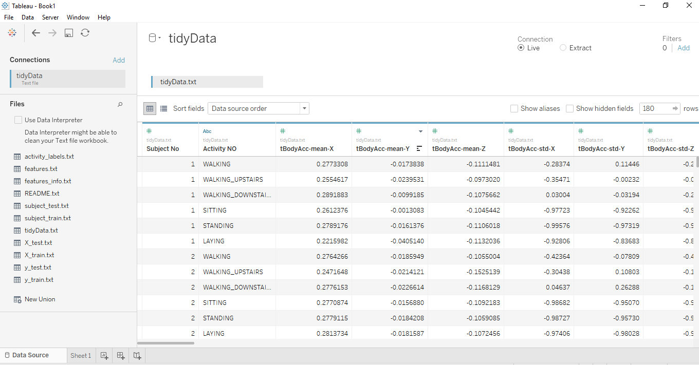

# Human-Activity-Recognition-Using-Smartphones

**Coursera Getting & Cleaning Data Project**

## This repository contains the following files:

* **`README.md`**, this file, which provides an overview of the data set and how it was created.
* **`tidyData.txt`**, which contains the data set.
* **`CodeBook.md`**, the code book, which describes the contents of the data set (data, variables and transformations used to generate the data).
* **`run_analysis.R`**, the R script that was used to create the data set (see the Creating the data set section below)

**The training and test sets were merged to create one data set i.e the _`tidyData.txt_`**

**Snapshot of the TidyData set in Tableau**

